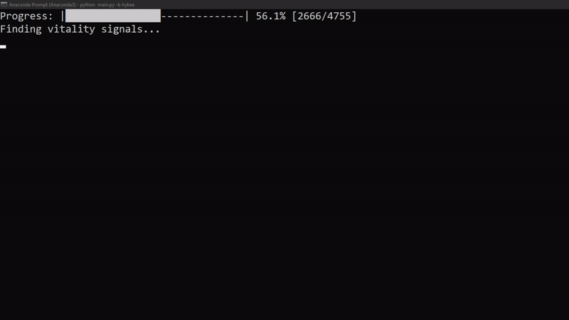
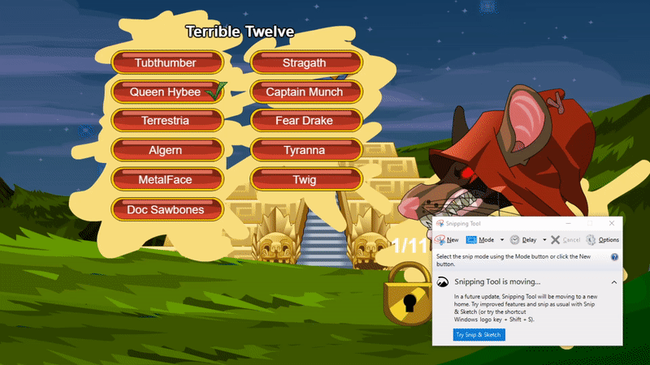
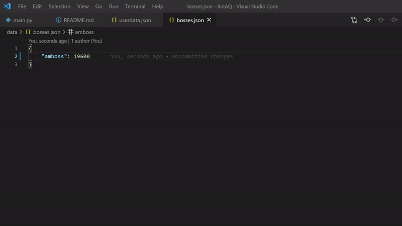
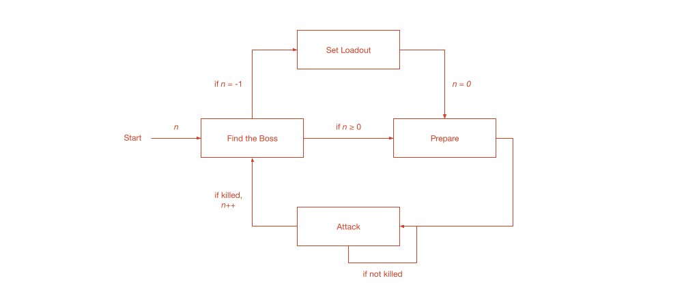

# BotAQ
BotAQ is a CLI bot made to grind bosses in Adventure Quest. It utilises the PyAutoGUI library to simulate human input and perform template matching. Unfortunately, this was not made with versatility in mind, as it requires the player to reach certain specific conditions within the game. 

## Usage
```bash
# Install dependencies
$ pip install -r requirements.txt

# Execute script
$ python main.py -b <boss-name>
```
<div align="center">
  
</div>

## Custom Bosses
1. Save a screengrab template of the boss you have chosen and save it into the templates folder

<div align="center">
  
</div>

2. Open bosses.json and add your own boss flag along with the experience points gained per battle

<div align="center">
  
</div>

## How it works
BotAQ is based on five fundamental steps.

<div align="center">
  
</div>

#### Finding the Boss
A template matcher looks for the selected boss and challenges it.

#### Set Loadout
A one-time phase to permanently set the player's loadout is engaged to identify if the player has utilised specific abilities/equipments. This is to ensure that the boss is killed as efficiently as possible.

#### Prepare
The preparationary phase is only engaged once per battle. This is used to cast semi-permanent buffs on the player.

#### Attack
An attack is performed on the boss and checked if it is killed for every attack. If the boss is not killed, the function is repeated.

#### Repeat
If the boss is killed, the steps are repeated without the setting the loadout again. This cycle eventually stops when the maximum daily limit of fighting the boss is reached. Player has the choice whether to keep last experience points gained from previous sessions.

## Future Works
There may be plans to use a Optical Character Recognition (OCR) engine or deep-learning model to recognise certain texts and improve the versatility of this project. There are plans to switch to the game's timezone for easier saving of user data.
